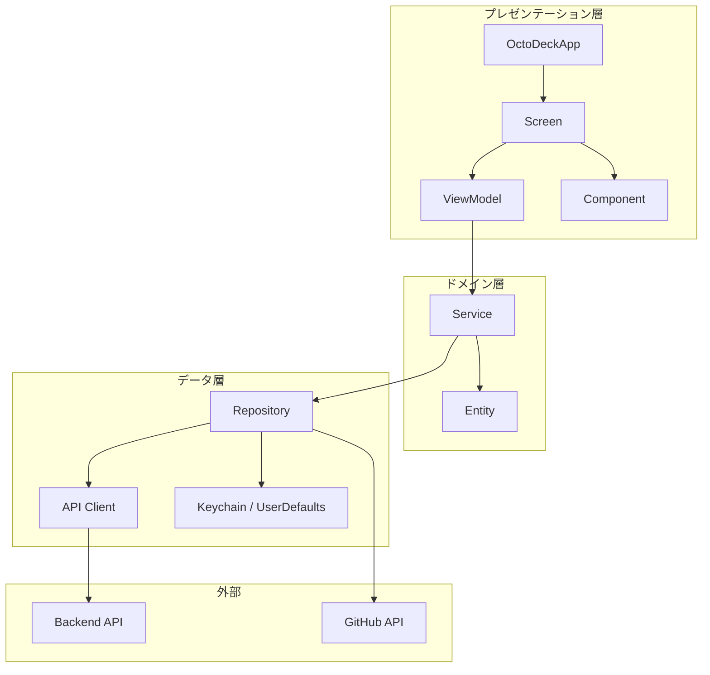
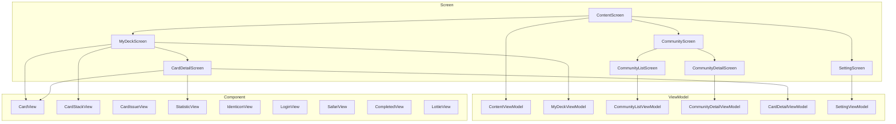
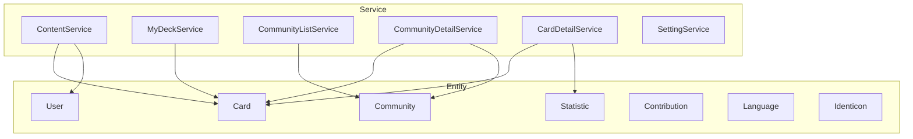
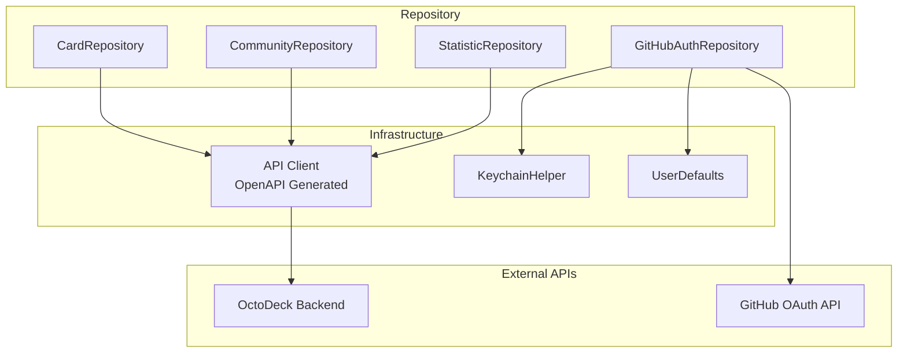
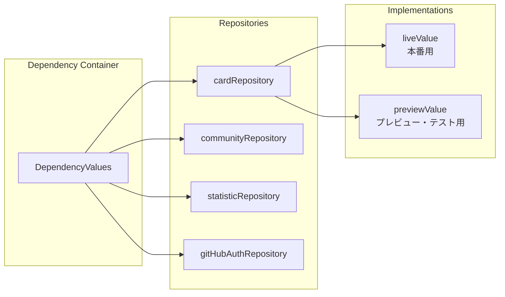
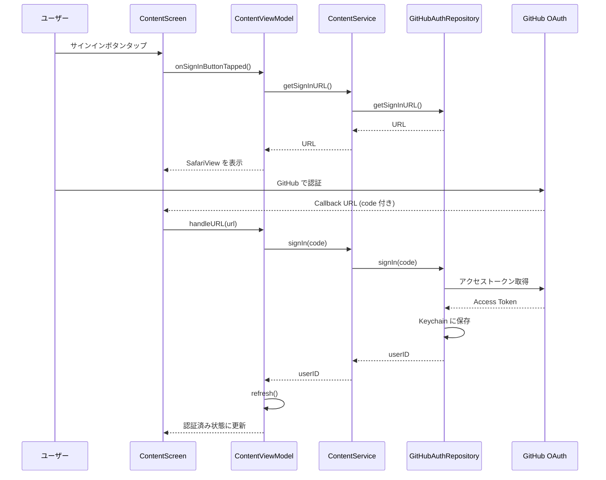
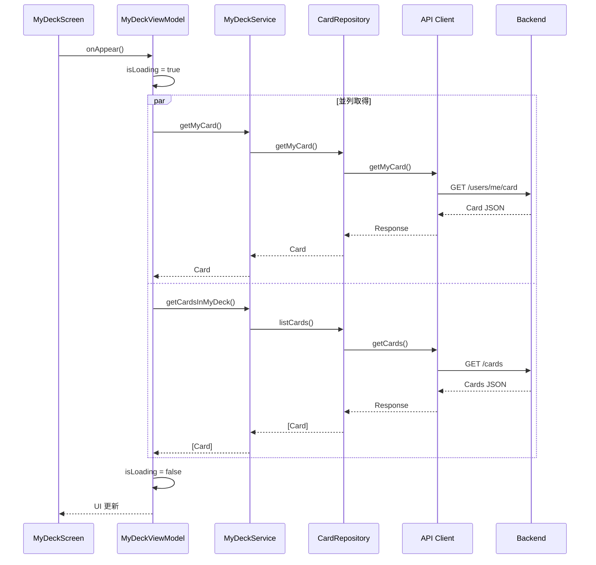
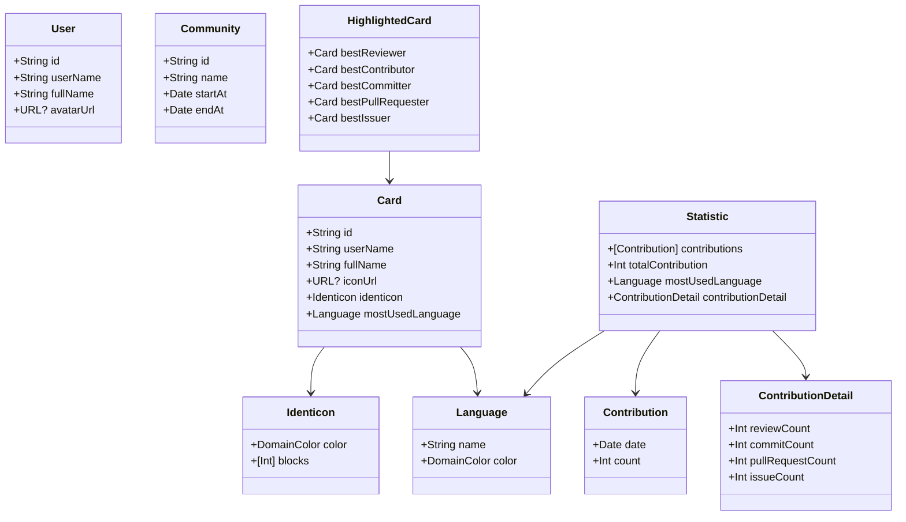

# OctoDeck iOS アーキテクチャ

## 概要

OctoDeck は GitHub のコントリビューション情報をカード形式で表示し、コミュニティ内でカードを交換できる iOS アプリケーションです。

本アプリケーションは **MVVM + Service + Repository** パターンを採用しており、関心の分離と依存性注入（DI）によるテスタビリティを重視した設計となっています。

---

## 全体アーキテクチャ



---

## レイヤー構成

### 1. プレゼンテーション層 (Presentation Layer)

UI と UI の状態管理を担当するレイヤーです。SwiftUI と Observation framework を使用しています。



| 名前          | 責務                                                                                           |
| ------------- | ---------------------------------------------------------------------------------------------- |
| **Screen**    | 画面単位のビュー。ViewModel を保持し、ユーザーインタラクションを処理                           |
| **ViewModel** | UI の状態管理。`@Observable` マクロで状態を公開し、`@MainActor` でメインスレッドでの実行を保証 |
| **Component** | 再利用可能な UI コンポーネント。状態を持たず、親から渡されたデータを表示                       |

---

### 2. ドメイン層 (Domain Layer)

ビジネスロジックとドメインモデルを担当するレイヤーです。



| 名前        | 責務                                                                             |
| ----------- | -------------------------------------------------------------------------------- |
| **Service** | ビジネスロジックの実装。`actor` として定義され、スレッドセーフなデータ処理を実現 |
| **Entity**  | ドメインモデル。`Card`, `User`, `Community`, `Statistic` など                    |

---

### 3. データ層 (Data Layer)

外部データソースとの通信を担当するレイヤーです。



| 名前               | 責務                                                           |
| ------------------ | -------------------------------------------------------------- |
| **Repository**     | データアクセスの抽象化。`@DependencyClient` マクロで DI に対応 |
| **API Client**     | OpenAPI Generator で生成。バックエンド API との通信            |
| **KeychainHelper** | アクセストークンの安全な保存                                   |

---

## 依存性注入 (Dependency Injection)

[swift-dependencies](https://github.com/pointfreeco/swift-dependencies) を使用して依存性注入を実現しています。



各 Repository は以下の実装を持ちます：

- **liveValue**: 本番環境で使用される実際の API 呼び出し
- **previewValue**: SwiftUI プレビューおよびテストで使用されるモック

---

## データフロー

### 認証フロー



### カード取得フロー



---

## Entity 構成



---

## ディレクトリ構成

```
OctoDeck/
├── OctoDeckApp.swift          # アプリケーションエントリーポイント
├── Screen/                    # 画面（View）
│   ├── ContentScreen.swift
│   ├── MyDeckScreen.swift
│   ├── CommunityScreen.swift
│   ├── CommunityListScreen.swift
│   ├── CommunityDetailScreen.swift
│   ├── CardDetailScreen.swift
│   └── SettingScreen.swift
├── ViewModel/                 # ViewModel
│   ├── ContentViewModel.swift
│   ├── MyDeckViewModel.swift
│   └── ...
├── Service/                   # ビジネスロジック
│   ├── ContentService.swift
│   ├── MyDeckService.swift
│   └── ...
├── Repository/                # データアクセス
│   ├── CardRepository.swift
│   ├── CommunityRepository.swift
│   ├── StatisticRepository.swift
│   └── GitHubAuthRepository.swift
├── Entity/                    # ドメインモデル
│   ├── Card.swift
│   ├── User.swift
│   ├── Community.swift
│   └── ...
├── Component/                 # 再利用可能 UI コンポーネント
│   ├── CardView.swift
│   ├── CardStackView.swift
│   └── ...
├── Helper/                    # ユーティリティ
│   ├── APIClient.swift
│   ├── APIAuthMiddleware.swift
│   ├── KeychainHelper.swift
│   └── ...
└── openapi/                   # OpenAPI 定義
    └── openapi.yaml
```

---

## 技術スタック

| カテゴリ           | 技術                                                                        |
| ------------------ | --------------------------------------------------------------------------- |
| UI フレームワーク  | SwiftUI                                                                     |
| 状態管理           | Observation framework (`@Observable`)                                       |
| 依存性注入         | [swift-dependencies](https://github.com/pointfreeco/swift-dependencies)     |
| API クライアント   | [swift-openapi-generator](https://github.com/apple/swift-openapi-generator) |
| 認証               | GitHub OAuth 2.0                                                            |
| セキュアストレージ | Keychain Services                                                           |
| アニメーション     | Lottie                                                                      |

---

## 設計原則

1. **関心の分離**: 各レイヤーは単一の責務を持ち、他のレイヤーの詳細を知らない
2. **依存性逆転**: Service は Repository のプロトコルに依存し、具体的な実装には依存しない
3. **テスタビリティ**: DI により Repository をモックに差し替え可能
4. **スレッドセーフ**: Service は `actor` として実装され、データ競合を防止
5. **型安全**: OpenAPI から生成された型により API 呼び出しの型安全性を保証
